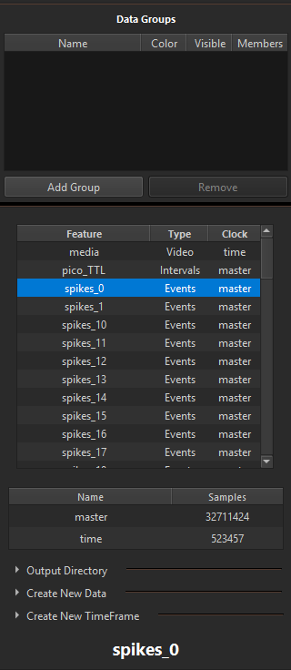
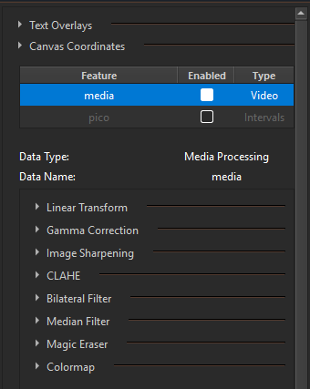
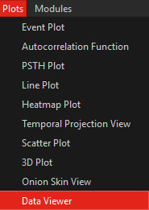
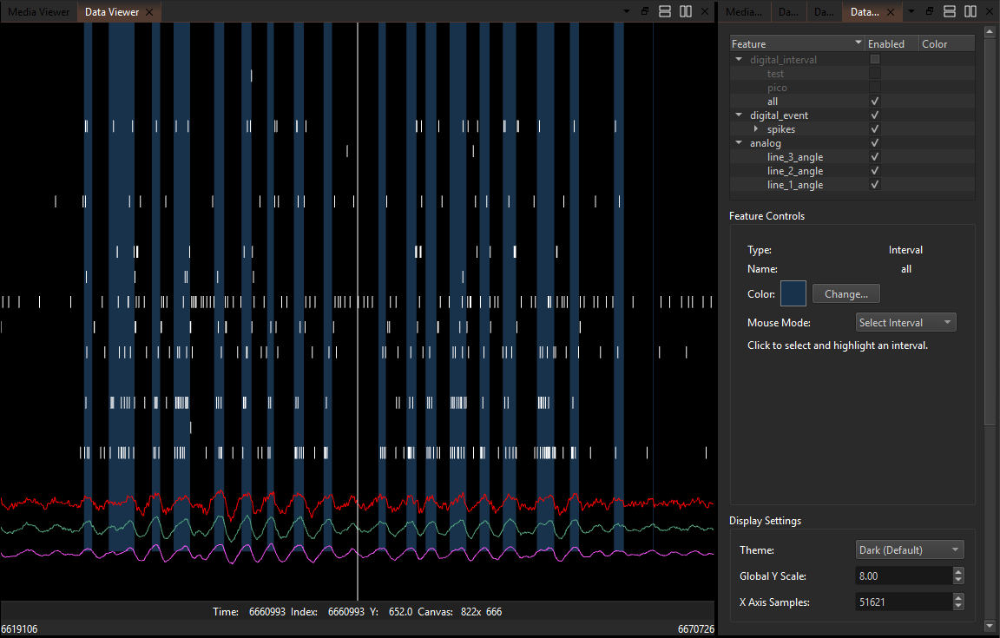
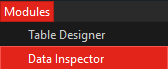
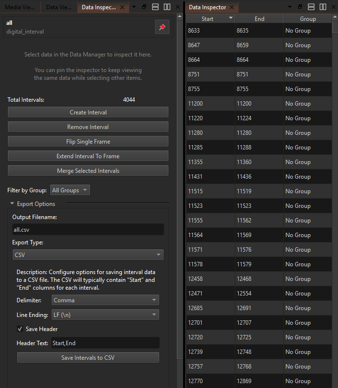

This concept page gives a practical model of where to create and edit
features, where to visualize them, and where to curate labels.

## The Short Version

- **Data Manager**: create data objects and assign TimeFrames.
- **Media Viewer**: spatial annotation and frame-level editing on image/video.
- **Data Viewer**: timeline-based visualization of analog, event, and interval data.
- **Data Inspector**: precise per-feature editing, curation, and table-driven operations.

## What Each Tool Is Best For

| Tool | Primary role | Typical actions |
|---|---|---|
| Data Manager | Data orchestration | Create keys, choose data type, assign TimeFrame, organize features |
| Media Viewer | Spatial labeling | Draw/edit points, masks, and lines on frames |
| Data Viewer | Temporal visualization | Compare traces with events and intervals across time |
| Data Inspector | Data curation and correction | Create/remove/extend/merge intervals, clean event series, inspect table rows |

## Where They Appear in the UI

### Data Manager

{fig-align="center"}

In the default startup layout, the Data Manager is docked on the left
side of the screen. It acts as the main navigation and selection panel:

- The top table lists data keys and data types.
- Selecting a key loads data-type-specific controls and tables.
- It is where you create new features and assign TimeFrames.
- It is also a primary place for save/export workflows.

### Media Viewer

{fig-align="center"}

The Media Viewer controls what you see in the main central media window.
Its feature table and type-specific controls determine which overlays are
visible and editable.

When you select different data features, different manipulation options
appear for that type. For example, selecting a mask feature exposes mask
editing controls (such as brush-based drawing). See the
[Tutorial: Mask Labeling](../learning-resources/tutorials/mask_labeling.qmd)
for a practical walkthrough.

### Opening Data Viewer

{fig-align="center"}

### Data Viewer

{fig-align="center"}

This view is designed for synchronized temporal analysis across
modalities. A common layout includes analog traces (for example angle),
events (such as spikes), and intervals on the same timeline.

Manipulation and configuration for this view appear in the right-side
properties panel.

### Opening Data Inspector

{fig-align="center"}

### Data Inspector

{fig-align="center"}

Data Inspector provides table-centric curation tools for many data
types.

- In table-based inspectors, double-clicking rows/cells can jump the app
   to the corresponding frame or time index.
- Many inspector types also include export controls, allowing you to
   export modalities (for example points, lines, intervals, analog, and
   tensors) to formats such as CSV.

## Mental Model for Daily Work

1. Start in **Data Manager** to create the target feature and choose its
   TimeFrame.
2. Use **Media Viewer** when your edits are spatial and frame-based.
3. Use **Data Inspector** when your edits are object-level and
   curation-heavy (for example interval operations).
4. Use **Data Viewer** to validate timing consistency across modalities.
5. Use transforms or Python for derived features after manual curation.

## Common Patterns

### Pattern A: Spatial Labeling

- Create mask/point/line key in Data Manager.
- Label in Media Viewer.
- Validate temporal behavior in Data Viewer.
- Curate edge cases in Data Inspector.

### Pattern B: Event and Interval Curation

- Create event/interval keys in Data Manager.
- Edit and curate in Data Inspector.
- Validate against analog traces in Data Viewer.

### Pattern C: Feature Engineering

- Keep raw and curated features separate.
- Derive outputs with transforms or Python.
- Compare source and output in Data Viewer.

## Why This Separation Helps

- Reduces accidental edits in the wrong context.
- Keeps workflows reproducible and easier to audit.
- Makes it clear which widget is authoritative for each kind of action.

## See Also

- [TimeFrame](timeframe.qmd)
- [Python Console](../user_guide/python_console.qmd)
- [Tutorial: Using the Data Viewer](../learning-resources/tutorials/using_data_viewer.qmd)
- [Tutorial: Interval Series Labeling](../learning-resources/tutorials/interval_series_labeling.qmd)
