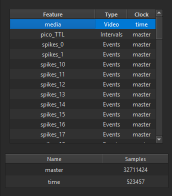
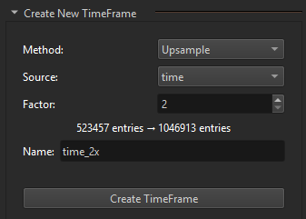

{fig-align="center"}

A **TimeFrame** defines the temporal coordinate system for a data
feature.

Each data object stores integer positions (`TimeFrameIndex` values), and
its associated TimeFrame defines what those indices mean in time.

## Why TimeFrames Matter

Different devices sample at different rates. If you mix modalities in a
single analysis, you need explicit time bases.

Example:

- Neural recording sampled at **30 kHz**.
- Video sampled at **500 Hz**.

For one second of recording:

- Neural data has 30,000 sample indices.
- Video has 500 frame indices.

Both describe the same physical second, but they use different index
grids. TimeFrame conversion keeps these streams aligned when you
visualize, label, and transform data.

## Data Types and Their Time Bases

Each feature key is bound to a TimeFrame. That binding determines how
its indices map to real time and how it synchronizes with other data.

Typical patterns:

- **MaskData / PointData / LineData**: often bound to a camera/video
	TimeFrame.
- **AnalogTimeSeries**: often bound to a DAQ or electrophysiology
	TimeFrame.
- **DigitalEventSeries / DigitalIntervalSeries**: can be bound to either
	camera or DAQ TimeFrames depending on how labels were created.
- **TensorData**: typically bound to the TimeFrame of the source data
	used to build it.

Why this matters:

- Two features can look aligned visually but be misaligned if their
	TimeFrames differ unexpectedly.
- Labeling and transform outputs should remain in the intended temporal
	coordinate system.
- Cross-modal analysis depends on explicit TimeFrame-aware conversion.

## Sampling and Index Conversion

At sampling rate $f_s$, index $i$ maps to time:

$$
t = \frac{i}{f_s}
$$

So index `15000` at 30 kHz and index `250` at 500 Hz both correspond to
$t = 0.5$ seconds.

## Creating Your Own TimeFrame in the App

You can create a custom derived TimeFrame directly in the Data Manager:

1. Open **Modules > Data Manager**.
2. In the **Create New TimeFrame** section, choose **Method: Upsample**.
3. Select a **Source** TimeFrame.
4. Set the integer **Factor**.
5. Choose a new **Name**.
6. Click **Create TimeFrame**.

{fig-align="center"}

This creates a new upsampled TimeFrame with frame count:

$$
N_{out} = (N_{in} - 1) \cdot \text{factor} + 1
$$

After creation, the new TimeFrame appears in the TimeFrame table and in
the TimeFrame selector when creating new data features.

## Assigning TimeFrames to New Features

When creating data in Data Manager (**Create New Data**), choose the
feature's TimeFrame from the dropdown. This keeps labels, transforms,
and plots on the intended temporal grid.

## Python Console Integration

TimeFrame-aware scripting is available in Python:

- `dm.getData("feature_key")` to access data.
- `dm.getTimeKey("feature_key")` to inspect which TimeFrame it uses.

This is useful for custom transforms and synchronization logic beyond
built-in operations.

## See Also

- [Python Console](../user_guide/python_console.qmd)
- [Load Tabular Binary Events](../examples/tabular_binary_events.qmd)