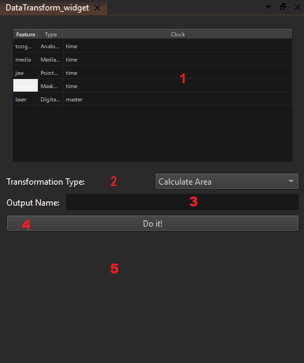

Data transformations are operations we perform on one kind of data that result in another kind of data.

## Reference Guides

- [Mask Transforms Reference](mask_transforms_reference.qmd)
- [Media Transforms Reference](media_transforms_reference.qmd)
- [Point Transforms Reference](point_transforms_reference.qmd)
- [Interval Transforms Reference](interval_transforms_reference.qmd)

These pages are being expanded incrementally, starting with the mask
transform family.
